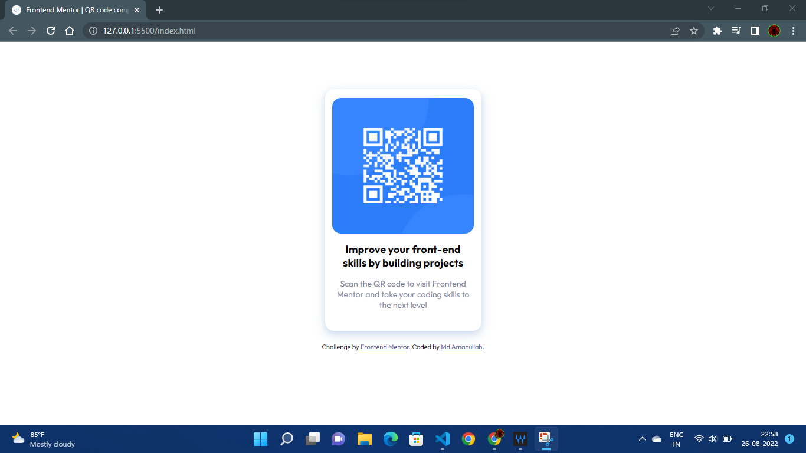

# Frontend Mentor - QR code component

## Welcome! 👋

This is a challenge task by front-end coding challenge.
Thanks for checking out this front-end coding challenge.

[Frontend Mentor](https://www.frontendmentor.io) challenges help you improve your coding skills by building realistic projects.
Skip to content
Search or jump to…
Pull requests
Issues
Marketplace
Explore
 
@Aman0786-git 
Aman0786-git
/
qr-code-component
Public
Code
Issues
Pull requests
Actions
Projects
Wiki
Security
Insights
Settings
qr-code-component/README-template.md
@Aman0786-git
Aman0786-git Initial Commit
Latest commit 0abbb64 6 minutes ago
 History
 1 contributor
42 lines (21 sloc)  980 Bytes

# Frontend Mentor - QR code component solution

This is a solution to the [QR code component challenge on Frontend Mentor](https://www.frontendmentor.io/challenges/qr-code-component-iux_sIO_H).
 Frontend Mentor challenges help you improve your coding skills by building realistic projects. 

## Table of contents

  - [Screenshot](#screenshot)
  - [Links](#links)
  - [What I learned](#what-i-learned)

### ScreenShot

### Links

- Solution URL: [Add solution URL here](https://github.com/Aman0786-git/qr-code-component)
- Live Site URL: [Add live site URL here](https://aman0786-git.github.io/qr-code-component/)

### Built with

- Semantic HTML5 markup
- CSS custom properties
- Flexbox

### What I learned

How to make QR Cards and some css properties

If you want more help with writing markdown, we'd recommend checking out [The Markdown Guide](https://www.markdownguide.org/) to learn more.

## Author

- Frontend Mentor - [@Aman0786-git](https://www.frontendmentor.io/profile/Aman0786-git)

Footer
© 2022 GitHub, Inc.
Footer navigation
Terms
Privacy
Security
Status
Docs
Contact GitHub
Pricing
API
Training
Blog
About

